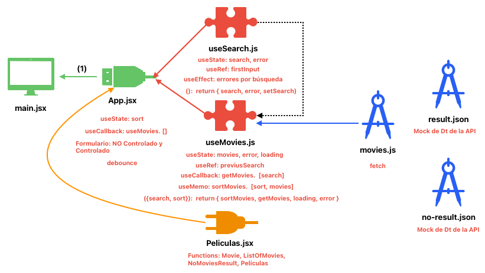
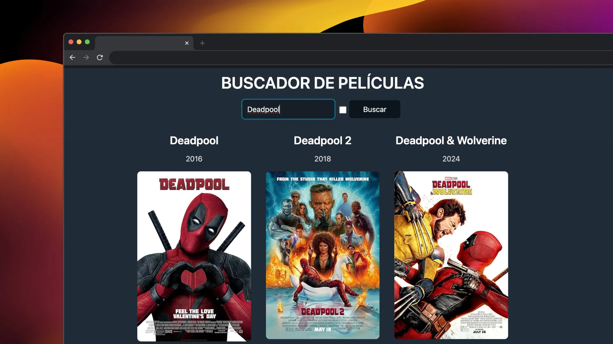

# PRUEBA TÉCNICA JUNIORS

Crea una aplicación para buscar películas.

API para usar: - https://www.omdbapi.com/

Consigue la API Key en la propia página web registrando tu email.

Requerimientos:
- Mostrar un input para buscar la película y un botón para buscar.
- Lista las películas y muestra el título, año y poster.
- Que el formulario funcione.
- Haz que las películas se muestren en un grid responsive.
- Hacer el fetching de datos a la API.

Primera iteración:
- Evitar que se haga la misma búsqueda dos veces seguidas.
- Haz que la búsqueda se haga automáticamente al escribir.
- Evita que se haga la búsqueda continuamente al escribir (debounce)

### ESQUEMA

  

### INTERFAZ

  

# 1 COMPONENTES
Peliculas.jsx

# 14 HOOKS 
(UseState (6), UseEffect (1), CustomHook (2), useRef (2), useMemo (1), useCallback (2) )

CustomHook (useSearch) --> UseEffect --> UseState (search, error) --> UseRef (firstInput)

‘firstInput' --> si el primer input es al entrar en la web, para no analizar ese ya que si no se mostraría el error siempre al principio ya que estará vacío

CustomHook (useMovies) --> UseState (movies, error, loading) --> useRef (previusSearch), useCallback (getMovies) --> UseMemo (sortMovies)

En el App.jsx --> UseState (sort) --> useCallback (getMovies)

# LÓGICA

Lo vamos a hacer increchendo y como lo haría paso a paso.
Esta prueba es muy típica porque hay que tocar un formulario, hay que validar muchas veces el formulario, hay que hacer el fetch de datos y además tienes que evitar hacer ese fetching cada vez que se renderice a través de sus conceptos.

Veremos UseRef,  UseMemo y UseCallback que nos servira para facilitar en ciertos casos en este proyecto.

La primera iteración se refiere a la conversación con el entrevistador que nos lo suelen pedir cuando hemos terminado con todos los requerimientos principales.

Para no complicarse con los estilos en esta clase de pruebas se puede utilizar un framework classless que son frameworks css que no utilizan clases, hay un montón como: water.css, bold.css, etc.
Para un apuro no sirve y nos da una interfaz más moderna y no perdemos tiempo con los estilos. Aunque también vamos a poner un poco de css para que quede todo centrado, normalmente todo cuando queda centrado queda bien.

TIPS DE PROGRAMACIÓN: 
- En el placeholder se debe de poner ejemplos de lo que se puede introducir, y no la etiqueta de lo que se debe de introducir.

- Está bien separar el formulario en el header y luego las películas se muestren en el main, así demostramos que sabemos de semántica.

Lo primero que hacemos es crear de forma estática el buscador con el botón para buscar en el ‘header’ y añadir los css para que quede centrado. Y con eso tendríamos el primer paso.

Vamos ahora a la API para buscar el endpoint para buscar películas. Hay que tener clarísimo que endpoints es antes de realizar cualquier fetch.

TIP: Nunca debemos de hacer fetch para ver la forma del objeto, queda fatal y pierdes mucho tiempo. Lo que se debe de hacer es ver la respuesta desde la API que devuelve en el navegador de un endpoint y copiarse la respuesta en un archivo por ejemplo ‘result.json’ y ya siempre desde ahí lo puedes visualizar.
Está bien tambien guardar el json que sale cuando no se encuentra ninguna película.

Ahora podemos trabajar con esto en vez de hacer el fetching de momento, porque imagínate que no se diese tiempo a mostrar el fetching al menos estarías mostrándolo la aplicación desde un mocking de datos. En la App lo puedes llamar y lo mejor de todo es que te va a chivar los tipos del Json.

Y con esto conseguíamos el punto 2 de mostrar las películas, aunque sea unas cuantas a través de un json en un mock dentro del proyecto.

Como buena práctica se puede dividir los renderizados como el listado de películas (o de no películas encontradas) .

¿Porque eso debería de ser un componente? Cualquier función o cualquier método que sea renderizado y que renderiza como un componente debería de ser un componente.

Ahí un montón de motivos por lo que debería de ser un componente, pero el más importante es que es más optimo. Al ser un componente no se va a volver a crear cada vez que se renderiza la aplicación.

Porque como lo tenemos ahora cada vez que se renderizan las funciones se vuelven a crear. Además, si el día de mañana le queremos pasar una props va a ser mucho más beneficioso y además se podrá utilizar fuera de este componente.

En un mismo fichero podemos crear varios componentes como: película, listaPelicula, sinPeliculas, condicionPeliculas (recordar que los componentes son funciones que empiezan por mayúsculas) y luego simplemente se le llama desde el ‘App.jsx’

TIP: tener los campos tal cual te da el json (el contrato de la API) tampoco es lo recomendable, es una mala práctica ya que si cambian el json ya tendríamos que cambiar uno por uno toda la aplicación y dichos campos al estar atado a como esta nombrado los campos del json. Por ello lo mejor es mapearlo por unos campos personalizados y de esta manera si cambian el json de la API solo tendríamos que cambiar dicho mapeo y no uno por uno en nuestra aplicación.

Ahora para hacer la lógica del funcionamiento, vamos a sacar en un CustomHook el mapeo y los beneficios que tiene esto es que lo convertiríamos en una caja negra.
Así nuestra App es agnóstico al mapeo de la API.

¿Como manejar formularios en React? Hay dos formas controlado y no controlada.

Veremos primero los tipos de forma NO CONTROLADA:

Es decir, a través de DOM, directamente desde el árbol de elementos, estamos confiando que el DOM va a tener la información o que el UseRef tiene la información.

Lo bueno es que la forma más sencilla y optima va super rápido. Es la recomendación.

Vamos a usar useRef para lo más típico ahora que es guardar una referencia del DOM (como el input de un formulario).

Primero, una buena práctica si tenemos un input y un botón es poner un formulario porque lo que nos permiten es englobar todos nuestros inputs.

Mejor que un handleClick vamos a poner un handleSubmit.
Mejor poner el ‘onSubmit’ en el formulario que en el botón el ‘onClick’ porque aparte de que se va a ver mucho más fácil, tiene otras ventajas que va a permitir recuperar toda la información mucho más fácil.

Se puede usar el ref={inputRef} y esto no está mal, pero hay mucha gente que abusa del useRef y empieza a poner referencias de cada uno de sus inputs como si no hubiera mañana.

Y hay una forma sencilla de recuperar la información sin tener que usar useRef y es una forma nativa, sencilla y rápida. Porque hay mucha gente que aprende React, pero no aprende JavaScript y muchas veces te facilita mucho más la vida.

Partimos dentro del handleSubmit: const campos = new FormData(event.target)

-	Recuperar un campo especifico campos.get('query')
-	Recuperar todos los inputs de golpe es con el Object.fromEntries(campos)

Ahora veremos la forma CONTROLADA:
Quiere decir que React controla que es lo que se escribe en nuestros inputs, como lo hace, como vamos a validarlo y esto lo hacemos gracias al Estado, vamos a tener un Estado para tener el control de lo que se dibuja en el input.

Pero el problema es que cada vez que se cambia una letra del input se está renderizando el componente todo el rato. Mas adelante veremos un Hook que puede arreglar esto.

Pero cual es la ventaja que tiene, es que te puede ayudar a simplificar la forma de validar los formularios. Eso si también se puede hacerse de la forma no controlada, solo que aquí de forma más sencilla.

Creando un nuevo estado de Error y usando un useEffect (con dependencia cada vez que cambie la Query) donde validar el estado creando anteriormente de la Query podríamos validar cada vez la Query para asignar o no el estado del error en un condicional dentro del renderizado.

O en vez de usar useEffect (con dependencia cada vez que cambie la Query) usar directamente dentro de la funcion donde recuperamos la Query (handleChange).

Lo único que hay que tener en cuenta que, si se usa el valor del estado, este puede llegar tarde, respecto el último error que toque. Ya que estamos tirando del estado ‘setQuery’ y estos son asíncronos (sin un orden de forma incluso paralela sin ser secuencial).

La solución sería declarar una constante antes donde obtenemos el valor y ese es el valor que validamos y de esta manera se la pasamos ya al estado ‘setQuery’ una vez está recogida bien.

Hay que acostumbrase a dejar los componentes siempre limpios y hacer todo a través de CustomHooks, dejando la lógica de los componentes fuera y así hacerlo en una caja negra.

Vamos a ver otro uso importantísimo del useRef. 
Un problema que nos encontramos es que de primera en la app nos dice que no se puede encontrar una película vacía ya que está haciendo la validación desde el principio mostrándose directamente ya el error al estar el input vacío.

Pues esto lo vamos a evitar con useRef poniéndolo a true y dentro del useEffect si es la primera vez va a entrar en el ‘if’ donde no se retorna y ya se pasa a false para cuando se renderice la próxima vez sí entre en el ‘if’ y que haga la validación.

Para estilos es importante aprender cómo hacer el GRID RESPONSIVE, lo piden casi siempre.

Hacemos primero que funcione la búsqueda del input, aunque usemos todavía el mock de datos para eso en el CustomHook que mapeábamos todo el listado de películas le tenemos que pasar un parámetro que sea el de ‘buscar’ donde pasemos lo puesto en el input.

Luego dentro CustomHook añadimos un estado como un array vacío para devolver el estado con las películas que coincidan con el ‘buscar’.
Y devolveríamos a parte del mapeo de las todas las películas el nuevo getPeliculas con las que estén seleccionadas a través del input.

Ahora funciona la búsqueda a través del formulario, pero sin hacer todavía el fetch todo obtenido a través del mock. 

Ahora hacer el fetch va a ser muy fácil, simplemente tenemos que cambiar la llamada en vez del mock y hacer el fetch el customHooks ‘useMovies.js’.

Para hacer el ese fetching lo sacaría en un servicio, porque el fetching no tiene sentido que este dentro del customHooks cuando lo podemos extraer fácilmente.

Recordar nunca hay que pasar el estado, y devolvemos siempre el fetching de datos.

Y ahora a demás dentro del CustomHook podemos añadir más características. Por ejemplo, hacer que cargue la página al buscar con un nuevo estado ’loading’.
 
Evitar que se haga la misma búsqueda dos veces seguidas, se pide para ver si se ha entendido viene el ‘useRef’. Se puede de muchas formas porque muchas veces se puede jugar con el ‘useRef’ para que venga con el estado anterior. 
Vamos a usar el ‘useRef’ para guardar la referencia anterior.

En el customHook simplemente serian añadir 3 líneas: crear el useRef, si el valor del useRef es igual al parámetro de ‘búsqueda’ devolver null y sino realizar la búsqueda y darle al useRef el valor de la búsqueda.

Vamos a crear un botón Sort y cada vez que damos al botón del sort o bien si ponemos cualquier cosa en el input se van a renderizar todo el componente (useMovie o app). 

Para esto vamos a usar existe el hook de useMemo.
Lo que hace es memoriza un valor para no tener que volver a calcular dependiendo de una lista de dependencias.

Lo que queremos es tener que evitar ordenar la lista de películas si no ha cambiado.

Ahora, aunque cambie el ‘buscar’ al ser unas dependencias que no me interesa no hará el sort hasta que o bien cambie el estado de orden o el listado de pelis a visualizar que serán las dependencias. Y todo esto hace que solo se renderice en estos casos.

En el customHook: pasamos el sort (true o false) como parámetro y hacemos una función en la que sí es false devuelve las películas y es true devuelve las películas, pero ordenadas y eso es lo que pasamos en el return.

Y en la app como siempre un estado para el sort y un input de tipo checkbox con el check del estado y un handle para cambiar dicho estado.

Pero vamos a usar mejor el useMemo, ya que sirve para para poder memorizar computaciones que hemos hecho que queremos evitar que se vuelvan a hacer a no ser que cambian las dependencias que seleccionemos.

El useMemo no hay que utilizarlo en todos sitios, muchas veces es mejor que se hagan cálculos cada vez que se renderiza, que no utilizar el useMemo en todos los sitios.
Aquí tenía sentido porque imagínate que había 1000 películas pues renderizarlas constantemente seria mucha sobrecarga, pero si fueran 10 no haría falta.

Ahora bien, todavía cada vez que cambiamos una letra el ‘getMovies’ se vuelve a renderizar ( lo que ya no se renderiza es el ‘sortMovies’). 

Esto todavía se puede mejorar, cada vez que se crea el ‘buscar’ se vuelve a ejecutar la función ‘getMovies’.  En vez de depender de ese ‘buscar’ vamos a utilizar uno que se inyecte por parámetro para poder generar las funciones una sola vez.

Ahora vamos a usar UseCallbacks que facilita el uso de UseMemo con las funciones. 
Es lo mismo que el UseMemo pero para funciones simplificando la sintaxis. Solo se usa para las funciones el UseCallbacks y el UseMemo para cualquier otra situación.

Ahora vamos a hacer que la búsqueda se haga automáticamente al escribir.
Cada vez que se meta una letra en el input que se haga automáticamente la búsqueda.

¿Pero cómo hacemos para que no ser realice cada vez que tecleamos una letra la búsqueda?

Tenemos que crear un debounce por rendimiento y porque es posible que una llamada vaya antes que la anterior.
El debounce seria vamos a hacer que el usuario mientras escribe no hacer nada y esperar un tiempo (300ms, 500ms) para que la última llamada que ha hecho el usuario sea la que vayamos a disparar.
Hay un montón de librerías de debounce. Vamos a verla a nivel más bajo por debajo de React.

